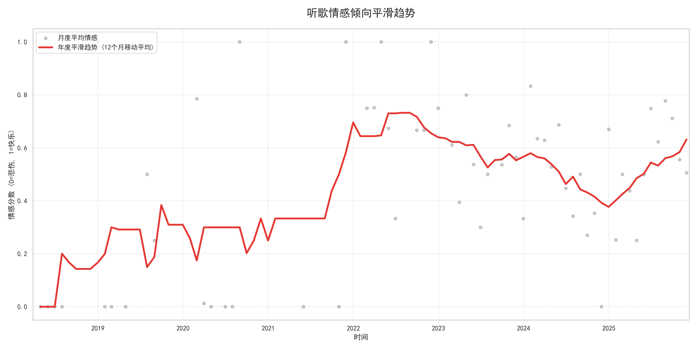
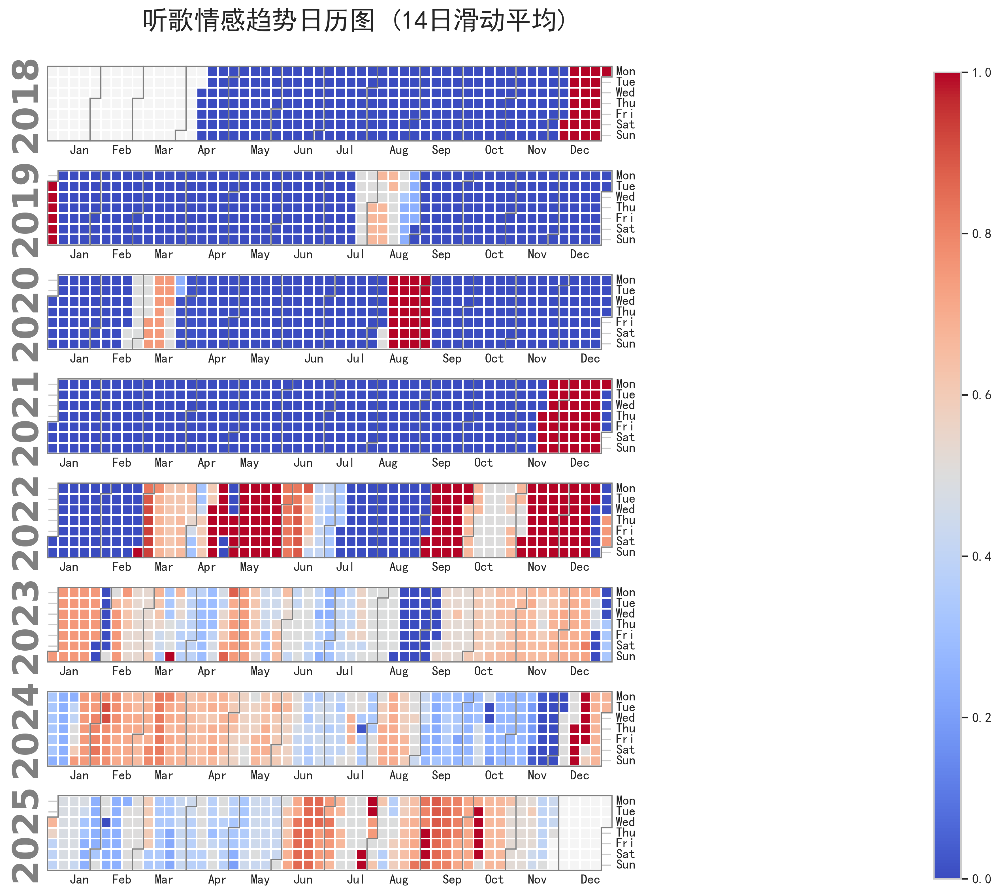
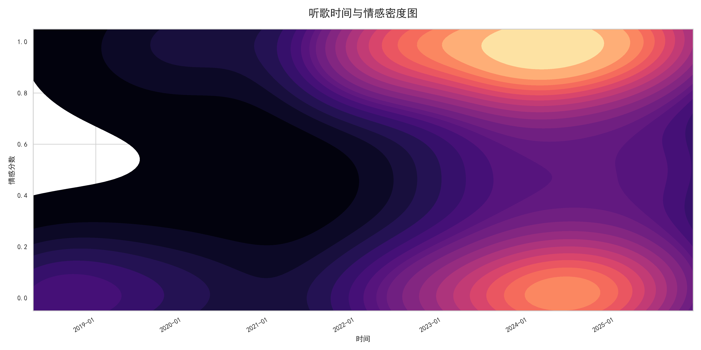
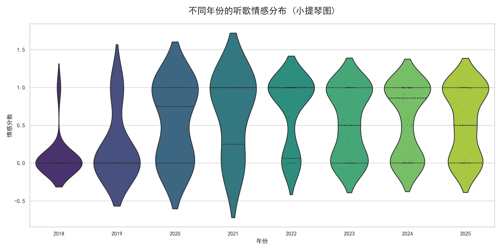
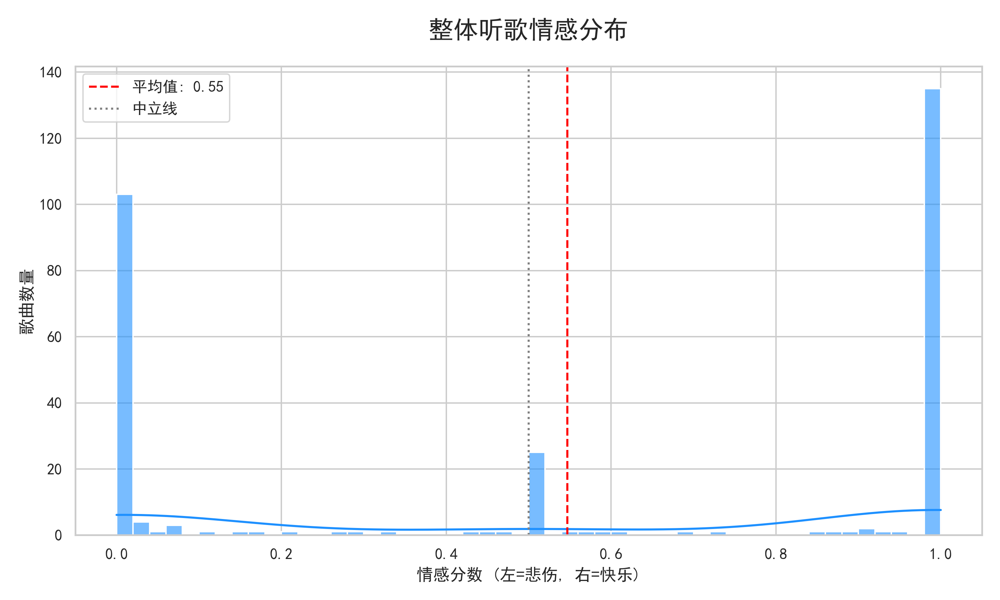

# 🎵 Netease Cloud Music Mood Analyzer (网易云音乐心情分析器)

> 基于歌词情感分析的听歌心情轨迹可视化工具。

这是一个基于 Python 的单脚本工具，旨在通过分析网易云音乐账号中“我喜欢的音乐”列表，挖掘你过往的听歌情感轨迹。它通过抓取歌词，利用 NLP 技术进行情感评分，并生成多维度的可视化图表，帮助你回顾不同时期的心情变化。

## ✨ 功能特性

*   **安全登录**：使用 `pyncm` 库实现扫码登录，无需手动输入账号密码。
*   **数据获取**：自动抓取“我喜欢的音乐”歌单中的所有歌曲信息及歌词。
*   **情感分析**：
    *   使用 `SnowNLP` 对中文歌词进行情感倾向分析（0=悲伤，1=快乐）。
    *   自动识别纯音乐（Instrumental）并标记为中立情感。
    *   支持本地缓存，避免重复抓取。
*   **多维可视化**：
    *   📈 **情感趋势图**：展示月度和年度的心情平滑曲线。
    *   🎻 **年度分布图**：使用小提琴图展示每年的情感分布密度。
    *   🌌 **密度热力图**：时间与情感深度的二维密度分析。
    *   📊 **整体分布图**：直方图展示整体听歌喜好（偏伤感还是偏快乐）。
    *   📅 **日历热力图**：类似 GitHub Contribution 的日历图，展示每日听歌心情色温。

## 🖼️ 可视化展示

以下是脚本运行后生成的分析图表示例：

### 1. 听歌情感倾向平滑趋势
回顾你长期的心情起伏，红线代表经过平滑处理的年度趋势。


### 2. 每日情感日历 (30日滑动平均)
以日历形式展示心情色温（蓝色代表低沉，红色代表高昂）。


### 3. 时间-情感二维密度图
展示在特定时间段内，你的听歌情感集中在哪个区间。


### 4. 年度情感分布 (小提琴图)
对比不同年份的听歌情感跨度和集中度。


### 5. 整体情感分布


## 🛠️ 环境配置与安装

本项目使用 [uv](https://github.com/astral-sh/uv) 进行极速依赖管理和环境配置。

### 前置要求
*   Python >= 3.13
*   已安装 `uv`

### 安装步骤

1.  **克隆仓库**
    ```bash
    git clone https://github.com/your-username/ncm-mood-analyzer.git
    cd ncm-mood-analyzer
    ```

2.  **同步依赖**
    使用 `uv` 根据 `pyproject.toml` 自动创建虚拟环境并安装依赖：
    ```bash
    uv sync
    ```

## 🚀 使用指南

项目主要包含一个代码文件（假设命名为 `main.py`）。你可以通过修改代码中的 `USE_LOCAL_DATA` 变量来切换模式。

### 模式一：首次运行（在线抓取）

1.  打开脚本文件，设置配置项：
    ```python
    # main.py
    if __name__ == "__main__":
        # ...
        USE_LOCAL_DATA = False  # 设置为 False 以启用登录和抓取
    ```
2.  运行脚本：
    ```bash
    uv run main.py
    ```
3.  终端会显示一个二维码，请使用 **网易云音乐 APP** 扫码登录。
4.  脚本将自动抓取歌单、下载歌词、进行情感分析，并生成图表。
5.  数据将保存为 `music_data_raw.csv` (原始数据) 和 `music_mood_data.csv` (分析结果)。

### 模式二：本地分析（无需登录）

如果你已经抓取过数据，或者想调整绘图风格而不想重新爬取：

1.  确保目录下存在 `music_mood_data.csv` 或 `music_data_raw.csv`。
2.  修改配置项：
    ```python
    # main.py
    if __name__ == "__main__":
        # ...
        USE_LOCAL_DATA = True  # 设置为 True 以使用本地数据
    ```
3.  运行脚本：
    ```bash
    uv run main.py
    ```

## 📂 项目结构

```text
.
├── main.py                 # 主程序代码
├── pyproject.toml          # uv 依赖配置文件
├── uv.lock                 # 依赖锁定文件
├── outputs/                # 存放生成的图片文件
│   ├── 1_smooth_trend.png
│   └── ...
├── music_data_raw.csv      # (自动生成) 原始歌单及歌词数据
├── music_mood_data.csv     # (自动生成) 包含情感评分的处理后数据
└── README.md               # 说明文档
```

## ⚠️ 注意事项

1.  **API 限制**：如果你的歌单非常大（几千首），频繁抓取可能会触发网易云的风控。脚本中已内置了简单的延时 (`time.sleep`)，但仍建议不要短时间内多次运行在线抓取模式。
2.  **字体问题**：脚本尝试使用 `SimHei`, `Microsoft YaHei` 或 `Arial Unicode MS` 来显示中文。如果生成的图片中中文显示为方框，请检查你的系统是否安装了这些字体，或在代码 `__init__` 部分修改为你系统中存在的支持中文的字体。
3.  **情感分析准确度**：`SnowNLP` 是基于电商评论数据训练的通用模型，对于歌词这种诗意化文本的分析可能存在偏差（例如将悲伤的情歌误判为中性），结果仅供娱乐参考。代码中预留了调用音乐识别模型（多模态）的实现接口，欢迎有余力的贡献者fork完善一下~

## 🤝 贡献

欢迎提交 Issue 或 Pull Request 来改进代码，例如增加更多有趣的图表。

## 📄 License

MIT License
